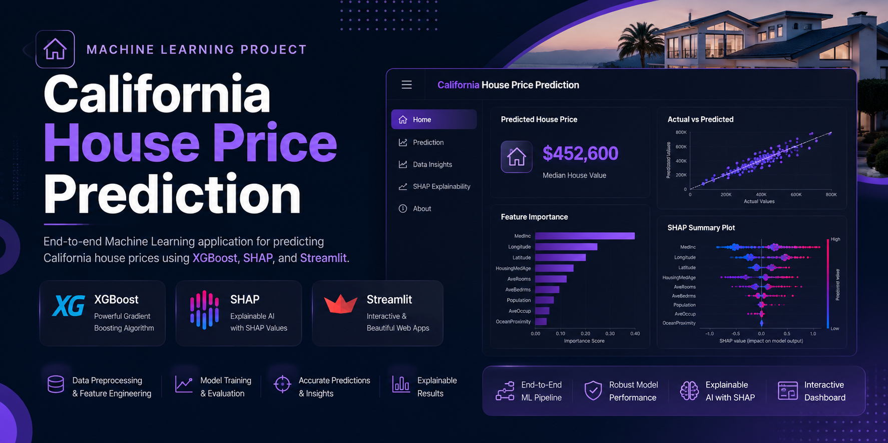
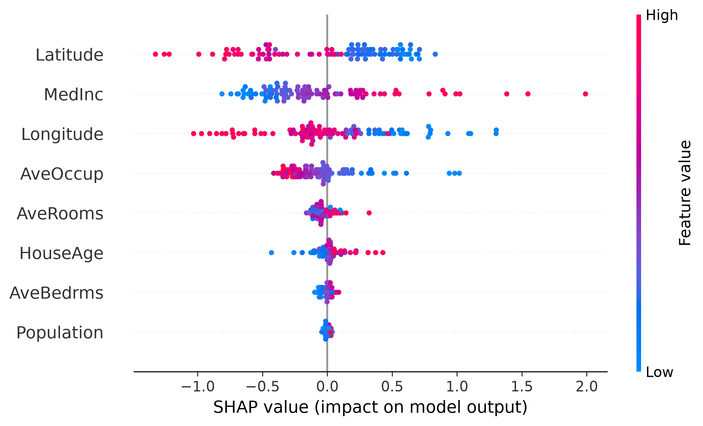

<p align="center">
  
</p>

# 🏡 California House Price Prediction

An end-to-end Machine Learning application that predicts California housing prices using the **XGBoost Regression** algorithm. The project demonstrates a complete supervised machine learning workflow—from data preprocessing and feature engineering to model training, evaluation, explainability with SHAP, and deployment through an interactive Streamlit web application.

The primary objective of this project is to build a maintainable and well-structured regression system while applying core machine learning engineering practices such as modular code organization, reproducible preprocessing, model persistence, and interactive inference.

Rather than focusing only on prediction accuracy, the project also emphasizes **model interpretability** by integrating SHAP (SHapley Additive Explanations), allowing users to understand how individual features influence each prediction.

This repository serves as a practical demonstration of developing, organizing, and deploying a machine learning application using modern Python-based tools and libraries.

---


# ✨ Key Features

- **End-to-End Machine Learning Pipeline**
  - Covers the complete regression workflow from data preprocessing and feature engineering to model training, evaluation, and deployment.

- **Interactive Prediction Interface**
  - Allows users to input housing attributes through an intuitive Streamlit interface and receive real-time price predictions.

- **XGBoost Regression Model**
  - Utilizes the XGBoost algorithm for robust regression performance on structured tabular data.

- **Explainable AI with SHAP**
  - Integrates SHAP (SHapley Additive Explanations) to provide transparent feature importance and local prediction explanations.

- **Comprehensive Model Evaluation**
  - Evaluates model performance using multiple regression metrics including R² Score, RMSE, and MAE.

- **Modular Project Structure**
  - Organized into separate modules for preprocessing, prediction, visualization, configuration, and utilities to improve maintainability.

- **Interactive Data Visualizations**
  - Provides visual insights into the dataset, feature relationships, and model behavior through informative charts.

- **Professional User Interface**
  - Responsive Streamlit dashboard with custom styling for an improved user experience.

- **Model Persistence**
  - Saves trained models and preprocessing objects using serialized artifacts for efficient inference without retraining.

  ---

# 🛠️ Tech Stack

## Programming Language

- Python 3.13

## Machine Learning

- Scikit-Learn
- XGBoost
- SHAP

## Data Processing

- Pandas
- NumPy

## Data Visualization

- Plotly
- Matplotlib

## Web Framework

- Streamlit

## Model Persistence

- Joblib
- Pickle

## Development Tools

- Git
- GitHub
- Visual Studio Code

## Environment

- Python Virtual Environment (venv)

---

# 📊 Dataset

This project uses the **California Housing Dataset**, a widely used benchmark dataset for supervised regression tasks. The dataset contains demographic, socioeconomic, and geographic information collected from California census districts and is commonly used for evaluating machine learning regression models.

## Target Variable

- **Median House Value**

The objective is to predict the median house value of a district based on its associated features.

## Input Features

- Median Income
- Housing Median Age
- Average Number of Rooms
- Average Number of Bedrooms
- Population
- Average Occupancy
- Latitude
- Longitude
- Ocean Proximity

## Dataset Characteristics

- Supervised Regression Problem
- Mixed Numerical and Categorical Features
- Moderate Dataset Size
- Suitable for Benchmarking Regression Algorithms

## Why This Dataset?

The California Housing dataset is an established benchmark for regression tasks and provides an appropriate foundation for demonstrating core machine learning concepts such as preprocessing, feature engineering, model training, evaluation, and explainability. While it is primarily intended for educational and benchmarking purposes rather than real-world deployment, it offers a reliable environment for implementing and validating an end-to-end machine learning pipeline.

---

# 🧠 Machine Learning Pipeline

The project follows a structured machine learning workflow to ensure consistent preprocessing, model training, evaluation, and prediction.

```text
California Housing Dataset
            │
            ▼
     Data Exploration
            │
            ▼
     Data Preprocessing
            │
            ├── Missing Value Handling
            ├── Feature Engineering
            ├── Encoding
            └── Feature Scaling
            │
            ▼
     Train-Test Split
            │
            ▼
     Model Training
      (XGBoost Regressor)
            │
            ▼
   Model Evaluation
(R², RMSE, MAE)
            │
            ▼
     Model Serialization
(Joblib / Pickle)
            │
            ▼
    Streamlit Deployment
            │
            ▼
 Real-Time Prediction +
 SHAP Explainability
```

## Workflow Summary

1. Load and explore the dataset.
2. Perform data preprocessing and feature engineering.
3. Split the data into training and testing sets.
4. Train the XGBoost regression model.
5. Evaluate model performance using multiple regression metrics.
6. Save the trained model and preprocessing artifacts.
7. Deploy the model using Streamlit.
8. Generate predictions and explain them using SHAP.

---

# 📈 Model Performance

The trained XGBoost Regression model was evaluated using standard regression metrics to measure prediction accuracy and generalization performance.

| Metric | Value |
|---------|-------|
| R² Score | XX.XX |
| RMSE | XX.XX |
| MAE | XX.XX |

# 📷 Application Preview

## Dashboard

<p align="center">

</p>

## SHAP Explainability

<p align="center">

</p>

## Evaluation Metrics

### R² Score

Measures how well the model explains the variance in house prices. Higher values indicate better predictive performance.

### Root Mean Squared Error (RMSE)

Measures the average prediction error while assigning greater penalty to larger errors.

### Mean Absolute Error (MAE)

Measures the average absolute difference between predicted and actual house prices, providing an interpretable measure of prediction error.

The XGBoost model demonstrated strong predictive performance on the California Housing dataset and outperformed traditional baseline regression approaches for this problem.

---

# 📂 Project Structure

```text
HousePricePrediction/
│
├── assets/
│   ├── css/
│   │   └── style.css
│   └── image/
│       ├── background.jpg
│       ├── hero.png
│       └── logo.png
│
├── configs/
├── data/
├── docs/
│   └── image/
│       ├── banner.png
│       ├── feature_importance.png
│       └── shap_summary.png
│
├── logs/
├── models/
├── notebooks/
│   └── exploratory_data_analysis.ipynb
│
├── app.py
├── train.py
├── requirements.txt
├── README.md
├── LICENSE
└── .gitignore
```
# ⚙️ Installation

```bash
git clone https://github.com/dharvi120/California-House-Price-Prediction.git

cd California-House-Price-Prediction

python -m venv .venv

# Windows
.venv\Scripts\activate

pip install -r requirements.txt

streamlit run app.py
```

## Repository Organization

- **assets/** – CSS styles and project images.
- **configs/** – Configuration files for the application.
- **data/** – Dataset used for model training and evaluation.
- **docs/** – Images and assets referenced in the README.
- **logs/** – Application log files.
- **models/** – Saved model artifacts and evaluation metrics.
- **notebooks/** – Exploratory Data Analysis (EDA) notebook.
- **app.py** – Streamlit application entry point.
- **train.py** – Model training script.

- # 🚀 Future Improvements

- Docker support
- FastAPI inference service
- CI/CD pipeline
- Model versioning
- Cloud deployment
- Experiment tracking with MLflow
- Real-time monitoring

- # 👨‍💻 Author

**Dharvi**

GitHub: https://github.com/dharvi120

# 📄 License

This project is licensed under the MIT License.

